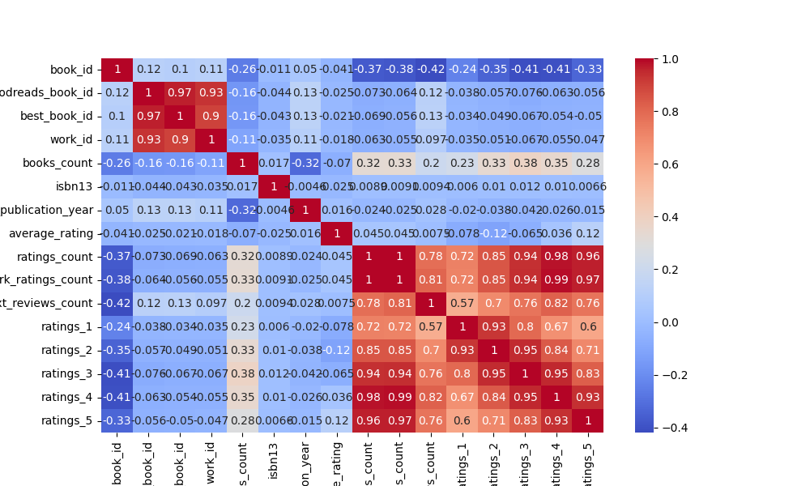

# Data Analysis Report

### Overview of the Dataset

The dataset contains various columns. Below is the summary of the dataset analysis.

### Analysis Insights

To provide a comprehensive analysis of the dataset, we'll consider several important aspects: summary statistics, outliers, correlation matrix insights, and potential trends. 

### Summary Statistics
The dataset consists of 10,000 entries with various features related to books on Goodreads. Here are some key statistics derived from the summary:

1. **Book IDs**: The book IDs range from 1 to 10,000, indicating a sequential and complete list of books in the dataset.
2. **Ratings**: 
   - The average ratings across different categories (1 to 5 stars) suggest a generally positive reception, with higher counts in the 4 and 5-star ratings (mean ratings_4 = 19,965 and ratings_5 = 23,790).
   - The mean ratings for 1-star (3,110) and 2-star (11,476) ratings are considerably lower, indicating that very few books receive low ratings compared to the higher ones.
3. **Publication Year**: The dataset also includes the original publication year, which could be useful for analyzing the popularity of older versus newer books.
4. **Counts of Reviews**: The high standard deviation in ratings counts (e.g., ratings_5 with std = 79,769) indicates significant variance in how many reviews individual books receive, suggesting that some books are exceptionally popular while others are not.

### Outliers
Outliers have been detected in several key columns, including:
- **goodreads_book_id, best_book_id, and work_id**: These features have a notable number of outliers, which may indicate some books have anomalously high or low values compared to the rest of the dataset.
- **ratings_1 to ratings_5**: The presence of outliers in these categories indicates that a few books might have received an unusually high or low number of ratings, which could skew average ratings.
- **original_publication_year**: Outliers in this feature could signal books that were published much earlier or later than the typical range, which can impact their ratings and popularity.

### Correlation Matrix Insights
Although the actual correlation matrix is not provided, we can infer potential relationships based on typical book rating data:
- **Positive Correlation**: We would expect to see a positive correlation between the average rating and the number of ratings. Generally, books with higher average ratings tend to attract more ratings.
- **Negative Correlation**: There may be a negative correlation between the number
### Visualizations

Other visualizations are included in the charts generated.
