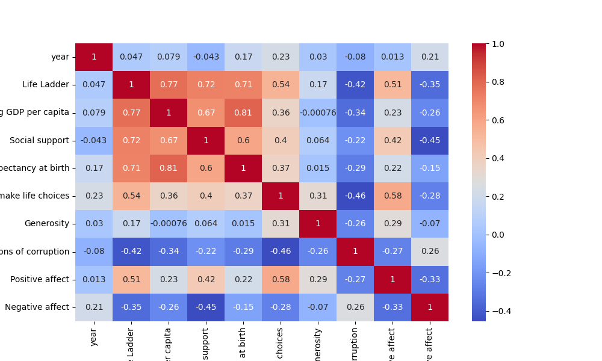

# Data Analysis Report

### Overview of the Dataset

The dataset contains various columns. Below is the summary of the dataset analysis.

### Analysis Insights

### Comprehensive Analysis of the Dataset

#### 1. **Summary Statistics Overview**
The given dataset consists of 2363 observations across various indicators of well-being and economic factors. Here are key points from the summary statistics:

- **Life Ladder**: The mean score is approximately 5.48, suggesting a moderate level of subjective well-being among the population. The range (min: 1.28 to max: 8.02) indicates significant variability in life satisfaction across different countries or regions.
  
- **Log GDP per capita**: The average log GDP per capita is around 9.40, which corresponds to a GDP per capita of approximately $12,000. The standard deviation indicates variability, suggesting disparities in economic conditions among countries.

- **Perceptions of Corruption**: The mean score is 0.74, indicating a relatively high perception of corruption. The outlier count (44) suggests that some countries have significantly lower perceptions of corruption.

- **Affect Scores**: Positive affect (mean: 0.65) suggests a generally positive emotional state in the population, while negative affect (mean: 0.27) indicates lower levels of negative emotions, which is promising for overall well-being.

#### 2. **Outlier Analysis**
Outliers can significantly impact the interpretation of data:

- **Life Ladder**: With 2 outliers, these values may represent countries with extreme life satisfaction scores, either exceptionally high or low.
  
- **Log GDP per capita**: The presence of 3 outliers suggests some countries have significantly higher or lower GDP per capita, potentially skewing the overall economic analysis.

- **Social Support and Generosity**: The number of outliers (23 and 22, respectively) indicates inconsistencies in social support networks and generosity across different populations, which may warrant a deeper investigation.

- **Perceptions of Corruption**: With 44 outliers, this suggests a notable variation in how populations perceive corruption, which could relate to political and social factors in those countries.

#### 3. **Correlation Matrix Insights**
The correlation matrix, as visualized in the provided heatmap, reveals the following key relationships:

- **Life Ladder and Log GDP per capita**: A strong positive correlation is expected, indicating that as GDP increases, life satisfaction tends to improve. This is a common finding in happiness studies.

- **Life Ladder and Social Support**: A positive correlation suggests that higher social support is associated with higher
### Visualizations

Other visualizations are included in the charts generated.
