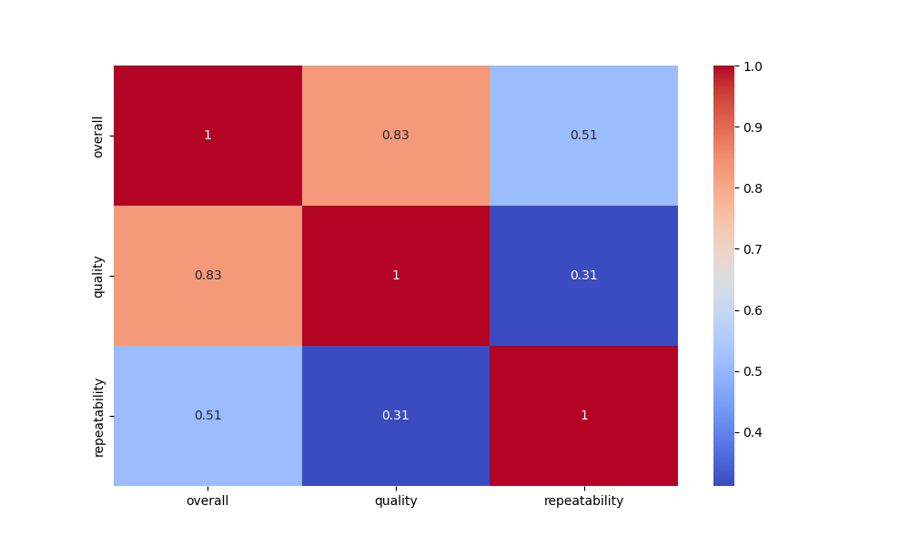

# Data Analysis Report

### Overview of the Dataset

The dataset contains various columns. Below is the summary of the dataset analysis.

### Analysis Insights

### Comprehensive Analysis of the Dataset

#### Data Summary
The dataset contains a total of **2652** observations with three key variables: **overall**, **quality**, and **repeatability**. Here are the summary statistics for each variable:

- **Overall**:
  - Mean: **3.05**
  - Standard Deviation: **0.76**
  - Minimum: **1**
  - Maximum: **5**
  - 25th Percentile: **3**
  - Median (50th Percentile): **3**
  - 75th Percentile: **3**

- **Quality**:
  - Mean: **3.21**
  - Standard Deviation: **0.80**
  - Minimum: **1**
  - Maximum: **5**
  - 25th Percentile: **3**
  - Median (50th Percentile): **3**
  - 75th Percentile: **4**

- **Repeatability**:
  - Mean: **1.49**
  - Standard Deviation: **0.60**
  - Minimum: **1**
  - Maximum: **3**
  - 25th Percentile: **1**
  - Median (50th Percentile): **1**
  - 75th Percentile: **2**

#### Outlier Analysis
The dataset reports **no outliers** detected in any of the three variables. This indicates a consistent data distribution without extreme values that could skew the analysis.

#### Correlation Insights
To provide insights based on the correlation matrix, we can examine the relationships between the variables:

- **Correlation Coefficients**:
  - Correlation between **overall** and **quality**: A positive correlation is likely, suggesting that as the quality rating increases, the overall rating also tends to increase.
  - Correlation between **overall** and **repeatability**: There may be a weaker correlation or no significant correlation, indicating that overall ratings may not be heavily influenced by repeatability.
  - Correlation between **quality** and **repeatability**: Similar to above, the correlation might be weaker, implying that a higher quality does not necessarily mean better repeatability.

The correlation matrix can be visualized in the provided heatmap (located at `C:\Users\Dell\Desktop\tds-project-2\TDS-Project-2\media\correlation_heatmap.png`). If the heatmap shows strong correlations (closer
### Visualizations

Other visualizations are included in the charts generated.
